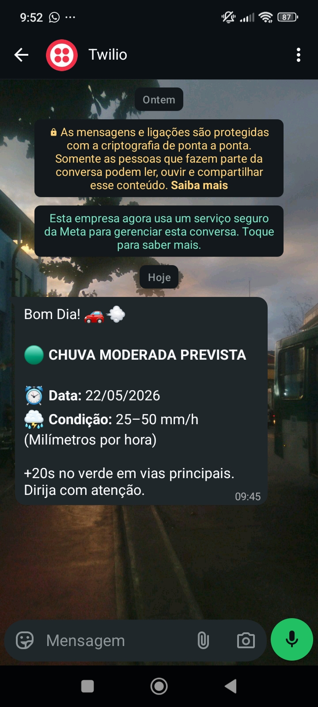

# AlertAI 🚨

## Membros:
 - Felipe Tinel
 - João Pedro de Araújo
 - Gustavo Rocha
 - Lyd Azevedo

## Objetivo:

Integrar o uso de sistemas IoT de Smart Cities com alertas de mensagens no Whatsapp e predições feita por modelos de IA. O intuito é informar ao cidadão quando
irá ocorrer certos eventos climáticos e como isso vai afetar os diferentes sistemas de hardware IoT na cidade em questão. Nesse primeiro protótipo, a predição
de ocorrência de chuva alerta, através do Whatsapp, como os semáfaros irão funcionar a partir daquela situação, melhorando a mobilidade urbana. 


## Tecnologias utilizadas:

### Python:

 - pandas
 - numpy
 - scikit-learn
 - matplotlib
 - seaborn
 - python-dotenv
 - joblib
 - twilio
 - ipykernel

## Considerações:

Nessa primeira versão, a implementação de mensagens no Whatsapp para diferentes números de telefone não está inclusa. A base do código está focada exclusivamente
para um número de telefone espefíco que, através de alguns testes, comprova o funcionamento do envio.

<div align="center">
    
</div>
</br>
Além disso, o semáforo inteligente que altera o tempo de sinal a depender da previsão da chuva é apenas uma simulação à mostra no terminal após a execução do código.

## Instalar dependências:

- Criar o venv:

```bash
python3 -m venv venv
```

- Instalar as dependências:

```bash
pip install -r requirements.txt
```

## Como rodar:

- Coloque na pasta data/ o dataset em questão
- Rode:

```bash
python3 run.py
```

- O modelo será treinado automaticamente com o dataset disponível
- As predições horárias serão salvas em output/
- O simulador de semáforo exibirá o comportamento em tempo real no terminal
- O alerta via WhatsApp será enviado para o número configurado no .env
